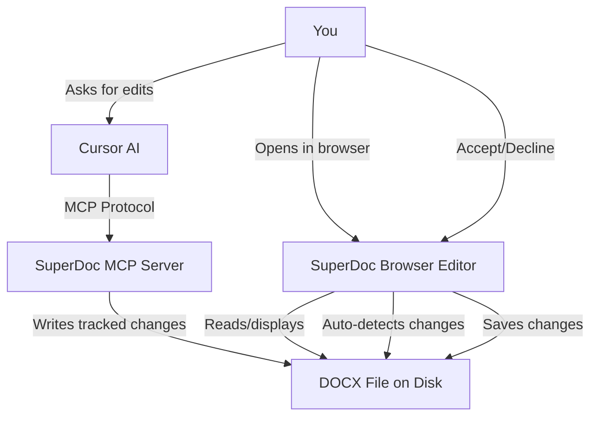

# SuperDoc + Cursor: Edit DOCX Files with AI

A browser-based DOCX editor that integrates with Cursor AI, enabling visual editing with tracked changes, direct local file access, and AI-powered document automation.

[](https://opensource.org/licenses/MIT)

## ✨ Features

- 📝 **Full DOCX editing** - Complete Word document support in the browser
- 💾 **Direct local file editing** - Changes save to original file on disk (no upload/download)
- 🤖 **AI integration** - Cursor makes tracked changes via MCP protocol
- ✅ **Visual tracked changes** - Accept/decline buttons for every edit
- 🔄 **Auto-sync** - Browser auto-reloads when Cursor edits your files
- 🔒 **100% local** - Documents never leave your machine
- ⚡ **Fast & responsive** - Built with React + Vite

## 🎬 Quick Demo

1. **Start the editor:**
   ```bash
   npm install
   npm run dev
   ```

2. **Open http://localhost:5173/** in Chrome/Edge

3. **Click "📂 Open DOCX File"** and select your document

4. **Ask Cursor AI** to make changes:
   ```
   Use SuperDoc MCP to suggest changing "Party A" to "WeGuide Health" in section 2
   ```

5. **Browser auto-reloads** and shows the tracked change

6. **Click "Accept" or "Decline"** - changes save automatically!

## 🚀 Installation

### Prerequisites

- **Node.js 18+** (with npm)
- **Chrome or Edge browser** (for File System Access API)
- **Cursor IDE** with AI features enabled

### Step 1: Clone and Install

```bash
git clone https://github.com/tsondag/superdoc-cursor.git
cd superdoc-cursor
npm install
```

### Step 2: Configure Cursor MCP

Add SuperDoc MCP server to `~/.cursor/mcp.json`:

```json
{
  "mcpServers": {
    "superdoc": {
      "command": "npx",
      "args": ["-y", "@superdoc-dev/mcp"]
    }
  }
}
```

**Important:** Restart Cursor completely after adding this config.

### Step 3: Install the Skill (Optional)

Copy the skill file to Cursor's skills directory:

```bash
mkdir -p ~/.cursor/skills/superdoc-cursor
cp SKILL.md ~/.cursor/skills/superdoc-cursor/
```

This gives Cursor detailed knowledge about working with DOCX files.

## 📖 Usage

### Basic Editing

**Start the editor:**
```bash
npm run dev
```

**Open a document:**
1. Visit http://localhost:5173/
2. Click "📂 Open DOCX File"
3. Select your DOCX file from your computer
4. Grant file permissions when browser asks
5. Edit and save!

### AI-Assisted Editing

**In Cursor chat, use these prompts:**

```
Use SuperDoc MCP to suggest replacing "UPDATE" with "WeGuide Biomarker" 
in the project name field

Use SuperDoc MCP to suggest adding "Prof Kim Delbaere" as Principal 
Investigator in section 4

Use SuperDoc MCP to suggest deleting the third paragraph in section 2.1
```

**Key tip:** Include the word **"suggest"** to ensure tracked changes mode.

### Filling Document Templates

For documents with multiple placeholder fields:

```
Use /response to fill in all UPDATE fields in this contract.
Search @Previous-documents for relevant information.
```

Cursor will:
1. Find each placeholder field
2. Search previous documents for answers
3. Present suggested answers with sources
4. Insert as tracked changes (after approval)
5. Continue until complete

## 🛠️ How It Works

### Architecture



### File System Access API

This app uses the modern [File System Access API](https://developer.mozilla.org/en-US/docs/Web/API/File_System_Access_API) to:
- Read files directly from your disk
- Save changes back to the original file
- Auto-detect when the file is modified externally (by Cursor MCP)
- No temporary files, no upload/download, no copies

**Browser compatibility:**
- ✅ Chrome 86+ (recommended)
- ✅ Edge 86+ (recommended)
- ✅ Opera 72+
- ❌ Firefox (not supported yet)
- ❌ Safari (not supported yet)

### Model Context Protocol (MCP)

Cursor uses [MCP](https://modelcontextprotocol.io/) to interact with SuperDoc:
- `superdoc_open` - Open a DOCX file
- `superdoc_find` - Search for text
- `superdoc_replace` - Replace text (with tracked changes)
- `superdoc_accept_all_changes` - Accept all tracked changes
- And many more...

## 📁 Project Structure

```
superdoc-cursor/
├── README.md              # This file
├── SKILL.md               # Cursor skill (detailed usage guide)
├── package.json           # Dependencies
├── vite.config.js         # Vite config
├── index.html             # HTML template
└── src/
    ├── App.jsx           # Main editor component
    └── main.jsx          # React entry point
```

## ⚙️ Configuration

### Document Modes

Edit `src/App.jsx` to change the editing mode:

```jsx
<SuperDocEditor
  document={document}
  documentMode="suggesting"  // Change this
  // Options: "editing" | "viewing" | "suggesting"
/>
```

- **`"suggesting"`** - Tracked changes mode (default, best for review)
- **`"editing"`** - Direct editing mode (changes applied immediately)
- **`"viewing"`** - Read-only mode

### Auto-Save Settings

Edit `src/App.jsx` to adjust auto-save interval:

```jsx
// Save every 30 seconds (change to your preference)
const autoSaveInterval = setInterval(() => {
  saveFile();
}, 30000); // milliseconds
```

### File Watching

Edit `src/App.jsx` to adjust how often it checks for external changes:

```jsx
// Check every 2 seconds (change to your preference)
fileCheckInterval.current = setInterval(async () => {
  // ... check logic
}, 2000); // milliseconds
```

## 🧩 Available MCP Tools

Once Cursor is restarted with MCP configured, these tools are available:

| Tool | Description |
|------|-------------|
| `superdoc_open` | Open a DOCX file for editing |
| `superdoc_save` | Save changes back to the file |
| `superdoc_close` | Close the document session |
| `superdoc_find` | Search for text patterns |
| `superdoc_get_text` | Get full plain-text content |
| `superdoc_insert` | Insert text (with tracked changes) |
| `superdoc_delete` | Delete text (with tracked changes) |
| `superdoc_replace` | Replace text (with tracked changes) |
| `superdoc_format` | Apply formatting (bold, italic, etc.) |
| `superdoc_list_changes` | List all tracked changes |
| `superdoc_accept_change` | Accept a specific change |
| `superdoc_reject_change` | Reject a specific change |
| `superdoc_accept_all_changes` | Accept all changes |
| `superdoc_reject_all_changes` | Reject all changes |
| `superdoc_add_comment` | Add a comment to text |
| `superdoc_list_comments` | List all comments |

## 🔧 Troubleshooting

### "File System Access API not supported"

**Problem:** Browser shows error about API not being supported.

**Solution:** Use **Chrome or Edge** browser. Firefox and Safari don't support this API yet.

### MCP Server Not Available in Cursor

**Problem:** Cursor doesn't recognize SuperDoc MCP tools.

**Solution:**
1. Verify `~/.cursor/mcp.json` has the superdoc entry
2. **Restart Cursor completely** (Cmd/Ctrl+Q and reopen)
3. Check Cursor's logs for MCP server startup errors

### File Not Saving

**Problem:** Changes don't persist to disk.

**Solution:**
1. Check browser console (F12) for error messages
2. Verify you have write permissions to the file
3. Close the file in other programs (like Microsoft Word)
4. Ensure you granted file permissions when browser asked

### Changes Not Appearing in Browser

**Problem:** Cursor made changes but browser doesn't show them.

**Solution:**
1. Wait 2 seconds for auto-reload to detect changes
2. Ensure Cursor used `suggest=true` (include "suggest" in prompt)
3. Manually click "Open Another" and re-select the file
4. Check file modification time to verify Cursor saved

### Port Already in Use

**Problem:** `npm run dev` says port is in use.

**Solution:** Vite automatically tries the next available port (5174, 5175, etc.). Check the terminal output for the actual URL.

## 📚 Examples

### Example 1: Editing a Contract

**Terminal:**
```bash
cd superdoc-cursor && npm run dev
```

**Browser:** Open http://localhost:5173/ → Select "contract.docx"

**Cursor Chat:**
```
Use SuperDoc MCP to open "contracts/collaboration-agreement.docx"

Please suggest changing "Party A" to "WeGuide Health" throughout the document
```

**Browser:** Shows tracked changes → Review → Click "Accept All" → Done!

### Example 2: Filling Multiple Fields

**Cursor Chat:**
```
Use /response to fill in all UPDATE fields in this grant application.
Search @Previous-grants for relevant information.
```

Cursor will systematically find and fill each field with tracked changes.

### Example 3: Document Review Workflow

**Day 1: Draft edits**
```
Use SuperDoc MCP to suggest adding section 2.3 covering IP ownership
```

**Day 2: Review**
- Open in browser
- Review all tracked changes
- Accept most, decline a few
- Save

**Day 3: Final polish**
```
Use SuperDoc MCP to suggest fixing typos in section 4
```
Accept all changes → Export final version

## 🤝 Contributing

Contributions are welcome! To contribute:

1. Fork this repo
2. Create a feature branch (`git checkout -b feature/amazing`)
3. Make your changes
4. Test thoroughly
5. Commit (`git commit -m "Add amazing feature"`)
6. Push (`git push origin feature/amazing`)
7. Open a Pull Request

## 📄 License

MIT License - see [LICENSE](LICENSE) file for details.

## 🙏 Acknowledgments

- [SuperDoc](https://superdoc.dev/) - Amazing DOCX library and MCP server
- [Cursor](https://cursor.sh/) - AI-powered code editor
- [Model Context Protocol](https://modelcontextprotocol.io/) - Open standard for AI integrations
- [File System Access API](https://developer.mozilla.org/en-US/docs/Web/API/File_System_Access_API) - Modern browser file access

## 🔗 Resources

- **SuperDoc Documentation:** https://docs.superdoc.dev
- **MCP Protocol:** https://modelcontextprotocol.io
- **File System Access API:** https://developer.mozilla.org/en-US/docs/Web/API/File_System_Access_API
- **Cursor IDE:** https://cursor.sh

## 💬 Support

- **Issues:** https://github.com/tsondag/superdoc-cursor/issues
- **Discussions:** https://github.com/tsondag/superdoc-cursor/discussions

## 📦 Built With

- [React](https://react.dev/) - UI framework
- [Vite](https://vitejs.dev/) - Build tool
- [SuperDoc](https://superdoc.dev/) - DOCX library
- [MCP](https://modelcontextprotocol.io/) - AI integration protocol

---

**Ready to start?**
```bash
git clone https://github.com/tsondag/superdoc-cursor.git
cd superdoc-cursor
npm install
npm run dev
```

Then open http://localhost:5173/ in Chrome/Edge and start editing! 🎉
