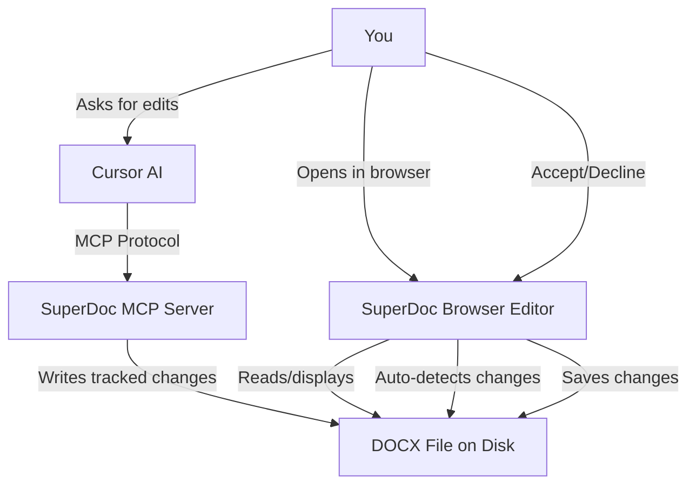

# SuperDoc + Cursor Integration Skill

## Overview

This skill enables seamless DOCX editing in Cursor with:
- **Direct local file editing** - Changes save to original file on disk
- **AI-powered suggestions** - Cursor makes tracked changes via MCP
- **Visual review** - Browser editor with accept/decline UI
- **Auto-sync** - Browser auto-reloads when Cursor edits files

## When to Use This Skill

Use this skill when you need to:
- ✅ Edit Word documents (.docx) with visual feedback
- ✅ Review and edit contracts with tracked changes
- ✅ Have Cursor AI suggest document edits you can approve/reject
- ✅ Work with DOCX files directly from disk (no upload/download)
- ✅ Fill in document templates or questionnaires
- ✅ Collaborate on document edits with visual diff review

**Don't use for:**
- ❌ PDF files (use pdf-to-markdown skill instead)
- ❌ Google Docs (they need export to DOCX first)
- ❌ Simple text files (use regular file editing)

## Architecture



## Setup (One-Time)

### 1. Install SuperDoc MCP Server

The MCP server is already configured in `~/.cursor/mcp.json`:

```json
{
  "mcpServers": {
    "superdoc": {
      "command": "npx",
      "args": ["-y", "@superdoc-dev/mcp"]
    }
  }
}
```

**Action required:** Restart Cursor to load the MCP server.

### 2. Start the Browser Editor

```bash
# Clone the public repo (first time only)
git clone https://github.com/tsondag/superdoc-cursor.git
cd superdoc-cursor

# Install dependencies (first time only)
npm install

# Start the editor
npm run dev
```

The editor will be available at: **http://localhost:5173/**

**Browser requirement:** Chrome or Edge (File System Access API not supported in Firefox/Safari)

## How to Use

### Basic Workflow

**Step 1:** Start the browser editor (if not running)
```bash
cd superdoc-cursor && npm run dev
```

**Step 2:** Open http://localhost:5173/ in Chrome/Edge

**Step 3:** Click "📂 Open DOCX File" and select your document

**Step 4:** Ask Cursor to make edits:
```
Use SuperDoc MCP to suggest changing "Vendor A" to "Acme Corp" in section 2
```

**Step 5:** Browser auto-reloads (2 seconds) and shows the tracked change

**Step 6:** Click "Accept" or "Decline" in the browser

**Step 7:** Changes save automatically to your original file

### Example Prompts for Cursor

When asking Cursor to edit DOCX files, use these prompt patterns:

**For tracked changes (recommended):**
```
Use SuperDoc MCP to suggest [change description] in [file path]
```

**Examples:**
```
Use SuperDoc MCP to suggest replacing "PLACEHOLDER" with "Project Phoenix" 
in the project name field of contract.docx

Use SuperDoc MCP to suggest adding "Dr. Sarah Johnson" as the 
Principal Investigator in section 4

Use SuperDoc MCP to suggest deleting the third paragraph in section 2.1
```

**Key word:** Always include "suggest" to ensure Cursor uses tracked changes mode (`suggest=true` parameter).

### Filling Document Templates

For documents with multiple UPDATE fields:

```
Use /response to fill in the remaining UPDATE fields in this contract.
Search @Previous-grants/folder-name for relevant information.
```

This will automatically:
1. Find each UPDATE field
2. Search previous documents for answers
3. Suggest answers with source attribution
4. Insert as tracked changes (after your approval)
5. Continue until all fields are complete

## Available MCP Tools

Once Cursor is restarted, these SuperDoc MCP tools are available:

### Document Lifecycle
- `superdoc_open` - Open a DOCX file for editing
- `superdoc_save` - Save changes back to the file
- `superdoc_close` - Close the document session

### Reading Content
- `superdoc_find` - Search for text patterns in the document
- `superdoc_get_node` - Get detailed info about a specific element
- `superdoc_get_text` - Get full plain-text content
- `superdoc_info` - Get document metadata and structure

### Editing (with tracked changes)
- `superdoc_insert` - Insert text (use `suggest=true`)
- `superdoc_delete` - Delete text (use `suggest=true`)
- `superdoc_replace` - Replace text (use `suggest=true`)
- `superdoc_format` - Apply formatting (use `suggest=true`)

### Tracked Changes Management
- `superdoc_list_changes` - List all tracked changes
- `superdoc_accept_change` - Accept a specific change
- `superdoc_reject_change` - Reject a specific change
- `superdoc_accept_all_changes` - Accept all changes
- `superdoc_reject_all_changes` - Reject all changes

### Comments
- `superdoc_add_comment` - Add a comment to a text range
- `superdoc_list_comments` - List all comments
- `superdoc_reply_comment` - Reply to a comment
- `superdoc_resolve_comment` - Mark comment as resolved

## Browser Editor Features

### File System Access API

The browser editor uses the modern File System Access API to:
- Read files directly from your disk
- Save changes back to the original file
- Auto-detect when the file is modified externally (by Cursor MCP)
- No upload/download needed - works directly with local files

### Document Modes

The editor runs in **"suggesting" mode** by default (tracked changes with accept/decline buttons).

To change modes, edit `superdoc-cursor/src/App.jsx`:

```jsx
<SuperDocEditor
  document={document}
  documentMode="suggesting"  // Change this
  // Options: "editing" | "viewing" | "suggesting"
/>
```

- `"suggesting"` - Tracked changes mode (default, best for review)
- `"editing"` - Direct editing mode (changes applied immediately)
- `"viewing"` - Read-only mode

### Auto-Save & Auto-Reload

**Auto-save:**
- Enabled by default
- Saves every 30 seconds
- Or click "💾 Save" button manually
- Toggle with checkbox in header

**Auto-reload:**
- Checks file every 2 seconds for external changes
- When Cursor MCP edits the file, browser automatically reloads
- Shows tracked changes with accept/decline buttons
- No manual refresh needed!

## Advanced Usage

### Working with Multiple Documents

To switch between documents:
1. Click "Open Another" button in browser
2. Select new document
3. Previous document is automatically saved

### Removing Tracked Changes (Accepting All)

To clean up and accept all changes at once:

```
Please accept all tracked changes in the current document to remove the yellow highlighting.
```

Cursor will use:
```javascript
superdoc_accept_all_changes()
superdoc_save()
```

### Custom MCP Commands

You can ask Cursor to perform any MCP operation:

```
Use SuperDoc MCP to list all comments in the document

Use SuperDoc MCP to find all instances of "UPDATE" in the contract

Use SuperDoc MCP to get document info and structure
```

## Troubleshooting

### MCP Server Not Available

**Problem:** Cursor doesn't recognize SuperDoc MCP tools

**Solution:** 
1. Check `~/.cursor/mcp.json` has the superdoc entry
2. **Restart Cursor** completely (Cmd/Ctrl+Q and reopen)
3. Check Cursor's logs for MCP server startup

### Browser Shows "Not Supported" Error

**Problem:** File System Access API not available

**Solution:** Use **Chrome or Edge** browser. Firefox and Safari don't support this API yet.

### File Not Saving

**Problem:** Changes don't persist to disk

**Solution:**
1. Check browser console (F12) for error messages
2. Verify you have write permissions to the file
3. Close the file in other programs (like Microsoft Word)
4. Check you granted file permissions when browser asked

### Changes Not Appearing in Browser

**Problem:** Cursor made changes but browser doesn't show them

**Solution:**
1. Wait 2 seconds for auto-reload to detect changes
2. Check that Cursor used `suggest=true` (mention "suggest" in your prompt)
3. Manually click "Open Another" and re-select the file
4. Check file modification time to verify Cursor saved the file

### Browser Editor Won't Start

**Problem:** `npm run dev` fails

**Solution:**
```bash
# Make sure you're in the right directory
cd /path/to/superdoc-cursor

# Reinstall dependencies
npm install

# Try starting again
npm run dev

# If port 5173 is in use, it will auto-try 5174, 5175, etc.
```

## Files and Structure

### Repository Structure
```
superdoc-cursor/
├── README.md                    # Public repo documentation
├── SKILL.md                     # This skill file
├── package.json                 # Dependencies
├── vite.config.js              # Vite configuration
├── index.html                  # HTML template
└── src/
    ├── App.jsx                 # Main editor component
    └── main.jsx                # React entry point
```

### Local Installation
```
~/.cursor/
├── mcp.json                    # MCP server config
└── skills/
    └── superdoc-cursor/
        └── SKILL.md            # This skill
```

## Technical Details

### Dependencies
- `@superdoc-dev/react@latest` - React component for SuperDoc
- `superdoc@latest` - Core SuperDoc library
- `react@^18.3.0` & `react-dom@^18.3.0` - React framework
- `vite@^6.0.0` - Build tool and dev server

### Browser Compatibility
- ✅ Chrome 86+ (recommended)
- ✅ Edge 86+ (recommended)
- ✅ Opera 72+
- ❌ Firefox (File System Access API not supported)
- ❌ Safari (File System Access API not supported)
- ❌ Mobile browsers (API not supported)

### Security & Privacy
- All processing happens locally on your machine
- Documents never leave your computer
- No data sent to external servers
- MCP server runs as local subprocess
- Browser accesses files only with explicit permission

### Performance
- File watching checks every 2 seconds (configurable)
- Auto-save every 30 seconds (configurable)
- Handles documents up to several hundred pages
- Instant visual feedback in browser

## Examples

### Example 1: Editing a Contract

```bash
# Terminal 1: Start browser editor
cd superdoc-cursor && npm run dev
```

```
# Cursor Chat:
Use SuperDoc MCP to open "contracts/partnership-agreement.docx"

Please suggest changing "Vendor A" to "Acme Corp" throughout the document
```

Browser shows tracked changes → Review → Click "Accept All" → Done!

### Example 2: Filling a Template

```
# Cursor Chat:
Use /response to fill in all UPDATE fields in this grant application.
Search @Previous-grants for relevant information.
```

Cursor will:
1. Find each UPDATE field
2. Search previous documents
3. Present suggested answers with sources
4. Insert as tracked changes (after approval)
5. Continue until complete

### Example 3: Document Review Workflow

**Day 1:** Draft edits
```
Use SuperDoc MCP to suggest adding section 2.3 covering IP ownership
```

**Day 2:** Review and refine
```
Open document in browser → Review all tracked changes → 
Accept most, decline a few → Save
```

**Day 3:** Final polish
```
Use SuperDoc MCP to suggest fixing typos in section 4
Accept all changes in browser → Export final version
```

## Integration with Other Skills

### Works Well With
- `@.cursor/rules/rfp-response-automation.mdc` - Auto-fill questionnaires
- `@.cursor/rules/writing-rules.mdc` - Writing style guidelines
- `@Previous submissions` - Source of information for templates

### Comparison with Python DOCX Skill

| Feature | SuperDoc (This Skill) | Python DOCX Skill |
|---------|----------------------|-------------------|
| Visual editing | ✅ Browser with preview | ❌ Text-based only |
| Tracked changes UI | ✅ Accept/decline buttons | ⚠️ Via XML manipulation |
| AI integration | ✅ Purpose-built MCP | ⚠️ Via file read/write |
| Real-time preview | ✅ Instant feedback | ❌ Must open file separately |
| Complex XML edits | ⚠️ High-level API | ✅ Full OOXML control |
| Batch automation | ⚠️ Interactive focus | ✅ Great for scripts |

**Recommendation:** 
- Use **SuperDoc** for interactive editing, contract review, and AI-assisted workflows
- Use **Python DOCX** for complex automation, batch processing, or low-level OOXML manipulation

## Public Deployment

This skill is publicly available at: **https://github.com/tsondag/superdoc-cursor**

Anyone can:
1. Clone the repo
2. Run `npm install`
3. Run `npm run dev`
4. Start editing DOCX files in Cursor!

The browser editor runs entirely locally - no server needed.

## Contributing

To improve this skill:
1. Fork the repo: https://github.com/tsondag/superdoc-cursor
2. Make improvements to the editor or documentation
3. Submit a pull request

## Resources

- **SuperDoc Documentation:** https://docs.superdoc.dev
- **File System Access API:** https://developer.mozilla.org/en-US/docs/Web/API/File_System_Access_API
- **MCP Protocol:** https://modelcontextprotocol.io
- **GitHub Repo:** https://github.com/tsondag/superdoc-cursor

## Quick Reference

### Essential Commands

Start editor:
```bash
cd superdoc-cursor && npm run dev
```

Ask Cursor to edit:
```
Use SuperDoc MCP to suggest [change] in [file]
```

Accept all changes:
```
Accept all tracked changes in the current document
```

Fill template fields:
```
Use /response to fill UPDATE fields. Search @Previous-grants
```

### Essential Files
- MCP config: `~/.cursor/mcp.json`
- Browser editor: `http://localhost:5173/`
- Skill file: `.cursor/skills/superdoc-cursor/SKILL.md`
- Public repo: `github.com/tsondag/superdoc-cursor`

---

**Ready to start?** 
1. Restart Cursor (to load MCP server)
2. Run `cd superdoc-cursor && npm run dev`
3. Open http://localhost:5173/ in Chrome/Edge
4. Ask Cursor: "Use SuperDoc MCP to suggest an edit to my contract"

Happy document editing! 🎉
